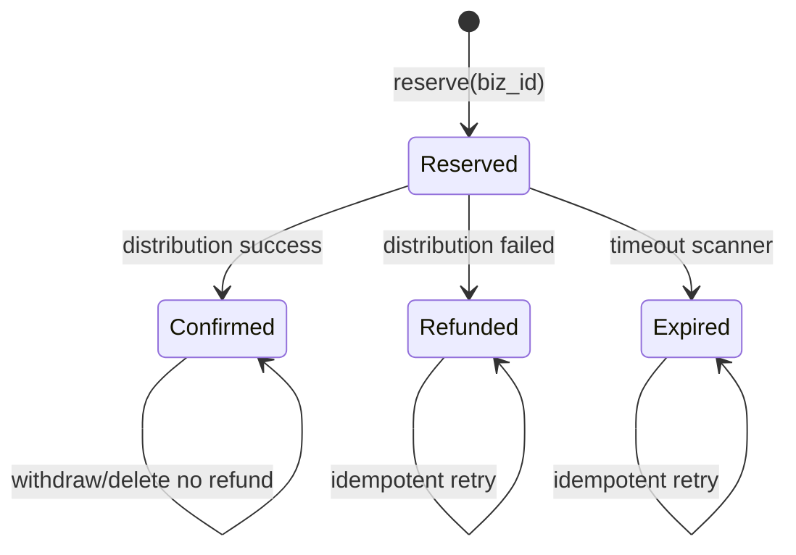

# PR1 客户套餐与渠道额度设计基线

v1.1 - 2026-05-06 修订记录：

- `company_package_binding` 明确增加 `standard_price`、`service_months` 套餐基础快照字段，避免套餐后续改价或改周期影响已绑定客户。

v1.2 - 2026-05-06 修订记录：

- 旧 `site` 分发链路在 PR1 显式拒绝，不再映射到 `industry_site`，避免错误扣减行业站额度。
- `package_channel_quota_config` 迁移不为既有套餐插入默认额度，既有套餐需运营显式配置后再绑定客户。
- `project publish quota` 旧接口在 PR1 标记为废弃错误，不返回月/周混杂的兼容假数据。
- `reserveDistribution` 使用 `REQUIRES_NEW` 独立提交，保证外部分发调用前预扣流水不会随业务外层事务回滚丢失。
- 兜底扫描采用三分法：成功任务确认，明确失败/取消/任务缺失才过期释放，运行中或未知状态仅刷新 `expire_checked_at` 后跳过。
- 客户解绑套餐前检查是否存在 `reserved` 额度流水；存在则拒绝解绑，先等待确认/退款/兜底处理。

本文档作为 PR1 实施基线，范围覆盖客户套餐绑定、问题池总额度、分发渠道额度、旧项目套餐字段清理，以及项目创建表单调整。当前环境为开发测试环境，不做历史数据兼容和迁移保留。

## 1. 表结构清单

### 1.1 新增表

#### company_package_binding

客户套餐绑定表。一个客户同一时间只能有一个有效套餐。

| 字段 | 类型 | 说明 |
| --- | --- | --- |
| id | BIGINT PK AUTO_INCREMENT | 主键 |
| company_id | BIGINT NOT NULL | 客户 ID |
| package_plan_id | BIGINT NOT NULL | 套餐 ID |
| package_type | VARCHAR(64) NOT NULL | 套餐类型快照 |
| package_name | VARCHAR(128) NOT NULL | 套餐名称快照 |
| standard_price | DECIMAL(10,2) NOT NULL DEFAULT 0.00 | 标准价格快照 |
| service_months | INT NOT NULL DEFAULT 0 | 服务周期快照 |
| question_pool_limit | INT NOT NULL | 客户问题池总额度快照 |
| channel_quota_snapshot | JSON NOT NULL | 渠道额度快照，后续 usage 初始化从该字段读取 |
| status | VARCHAR(20) NOT NULL | active / inactive |
| active_flag | TINYINT NULL | 唯一约束辅助字段；active=1，inactive=NULL |
| bound_at | DATETIME NOT NULL | 绑定时间 |
| unbound_at | DATETIME NULL | 解绑时间 |
| created_at | DATETIME NOT NULL | 创建时间 |
| updated_at | DATETIME NOT NULL | 更新时间 |

索引与约束：

- `uk_company_active_binding (company_id, active_flag)`：业务上只允许一个 active 绑定。active 记录写 `active_flag = 1`，inactive 记录写 `active_flag = NULL`，利用 MySQL 唯一索引允许多个 NULL 的特性保留历史绑定。
- `idx_company_package (package_plan_id)`
- FK：`company_id -> company(id)`，`package_plan_id -> package_plan(id)`

#### package_channel_quota_config

套餐渠道额度配置表。

| 字段 | 类型 | 说明 |
| --- | --- | --- |
| id | BIGINT PK AUTO_INCREMENT | 主键 |
| package_plan_id | BIGINT NOT NULL | 套餐 ID |
| channel_code | VARCHAR(32) NOT NULL | official_site / industry_site / self_media / authority_media |
| period_type | VARCHAR(16) NOT NULL | day / week / month / total |
| quota_limit | INT NOT NULL | 额度 |
| enabled | TINYINT(1) NOT NULL DEFAULT 1 | 是否启用 |
| created_at | DATETIME NOT NULL | 创建时间 |
| updated_at | DATETIME NOT NULL | 更新时间 |

索引与约束：

- `uk_package_channel_period (package_plan_id, channel_code, period_type)`
- `idx_channel_period (channel_code, period_type)`
- FK：`package_plan_id -> package_plan(id)`

#### company_channel_quota_usage

客户渠道用量聚合表。`quota_limit` 采用快照同步，不实时 JOIN 套餐配置。

| 字段 | 类型 | 说明 |
| --- | --- | --- |
| id | BIGINT PK AUTO_INCREMENT | 主键 |
| company_id | BIGINT NOT NULL | 客户 ID |
| channel_code | VARCHAR(32) NOT NULL | 渠道 |
| period_type | VARCHAR(16) NOT NULL | day / week / month / total |
| period_key | VARCHAR(32) NOT NULL | 2026-05-06 / 2026-W19 / 2026-05 / TOTAL |
| quota_limit | INT NOT NULL | 当前周期额度快照 |
| used_count | INT NOT NULL DEFAULT 0 | 已确认或已预扣占用数量 |
| created_at | DATETIME NOT NULL | 创建时间 |
| updated_at | DATETIME NOT NULL | 更新时间 |

索引与约束：

- `uk_company_channel_period (company_id, channel_code, period_type, period_key)`
- `idx_company_period (company_id, period_type, period_key)`
- FK：`company_id -> company(id)`

#### company_channel_quota_ledger

额度流水表，用于幂等、退款和排查。

| 字段 | 类型 | 说明 |
| --- | --- | --- |
| id | BIGINT PK AUTO_INCREMENT | 主键 |
| company_id | BIGINT NOT NULL | 客户 ID |
| project_id | BIGINT NULL | 项目 ID |
| channel_code | VARCHAR(32) NOT NULL | 渠道 |
| period_type | VARCHAR(16) NOT NULL | day / week / month / total |
| period_key | VARCHAR(32) NOT NULL | 周期键 |
| delta_count | INT NOT NULL | 本期固定为 1，预留批量能力 |
| status | VARCHAR(20) NOT NULL | reserved / confirmed / refunded / expired |
| biz_type | VARCHAR(32) NOT NULL | distribution |
| biz_id | VARCHAR(64) NOT NULL | 幂等业务 ID，PR1 使用 distribution task id |
| reserved_at | DATETIME NOT NULL | 预扣时间 |
| confirmed_at | DATETIME NULL | 确认成功时间 |
| refunded_at | DATETIME NULL | 退款时间 |
| expire_checked_at | DATETIME NULL | 兜底扫描时间 |
| created_at | DATETIME NOT NULL | 创建时间 |
| updated_at | DATETIME NOT NULL | 更新时间 |

索引与约束：

- `uk_quota_biz (biz_type, biz_id)`
- `idx_reserved_timeout (status, reserved_at)`
- `idx_company_channel (company_id, channel_code, period_type, period_key)`
- FK：`company_id -> company(id)`，`project_id -> project(id)`

PR1 明确采用“1 个分发任务只扣 1 个套餐渠道”的模型。一个任务如果未来需要分发到多个渠道，必须拆成多个 distribution task；每个 task 独立生成 `biz_id`、独立预扣、独立确认或退款。因此 `uk_quota_biz` 不包含 `channel_code`，防止同一 task 被错误重复扣多个渠道。

### 1.2 修改表

#### package_plan

保留套餐基础信息、价格、服务周期、问题池总额度等字段。删除 P0/P1/P2 平台套餐字段，新增或保留 `question_pool_size` 作为客户问题池总额度来源。

#### project

项目不再绑定套餐。删除项目套餐快照中的平台数量和每问题调用字段。`company_id`、`brand_id`、`project_name` 等项目归属字段保留。

### 1.3 删除表

#### project_publish_quota

旧项目维度月额度表直接删除。新额度全部走客户维度 `company_channel_quota_usage`。

## 2. usage 行初始化与刷新时机

usage 行采用懒初始化 + 绑定刷新。所有写入必须通过 `CompanyChannelQuotaService`。

### 2.1 客户绑定套餐

1. 校验客户当前没有 `active` 绑定。
2. 读取 `package_channel_quota_config`，生成 `channel_quota_snapshot`。
3. 写入 `company_package_binding`，保存套餐基础快照、问题池额度快照和渠道额度快照。
4. 初始化 `total` 类型 usage 行：`period_key = TOTAL`。
5. 对 `day/week/month` 类型不批量创建未来周期，只在首次使用时懒初始化。

### 2.2 客户切换套餐

1. 计算当前用量：
   - 问题池：客户下所有项目最新问题池版本的问题数总和。
   - 权重媒体：`authority_media + total + TOTAL` 已用量。
   - 频率渠道：当前周期 usage 已用量。
2. 若当前用量超过新套餐额度，拒绝切换。
3. 关闭旧 binding：`status = inactive`，`active_flag = NULL`。
4. 创建新 binding：`status = active`，`active_flag = 1`，写入新的 `channel_quota_snapshot`。
5. 刷新 `total` usage 的 `quota_limit`。
6. 刷新当前 `day/week/month` 周期 usage 的 `quota_limit`，未来周期按新套餐懒初始化。

### 2.3 套餐额度配置变更并同步到已绑定客户

PR1 默认不自动影响已绑定客户，避免后台改套餐导致客户权益突变。

若后台显式执行“同步到已绑定客户”：

1. 批量找出绑定该套餐的 active 客户。
2. 对每个客户执行与“切换套餐”相同的超额校验。
3. 校验通过后刷新 binding 的 `channel_quota_snapshot` 和当前 usage 的 `quota_limit`。
4. 校验失败的客户跳过并返回失败清单。

TODO：同步功能必须同时刷新 binding 的 `channel_quota_snapshot` 和已存在 usage 行的 `quota_limit`。否则会出现 `distributionQuota` 展示读取新快照、实际 `reserve` 仍按旧 usage 上限扣减的不一致。

### 2.4 分发预扣时懒初始化

1. 根据 `DistributionTargetKind` 映射套餐渠道。
2. 从当前 active binding 的 `channel_quota_snapshot` 读取该渠道的 `period_type` 和 `quota_limit`，不再从套餐配置表实时读取。
3. 按 period 规则计算 `period_key`。
4. `INSERT IGNORE` 创建 usage 行，`quota_limit` 来自当前 active binding 的 `channel_quota_snapshot`。
5. 原子扣减：

```sql
UPDATE company_channel_quota_usage
SET used_count = used_count + 1
WHERE company_id = ?
  AND channel_code = ?
  AND period_type = ?
  AND period_key = ?
  AND used_count < quota_limit;
```

6. 更新行数为 1 才写入 `reserved` ledger；否则返回额度不足。

### 2.5 period_key 生成规则

所有周期计算使用业务时区 `Asia/Shanghai`，禁止使用服务器默认时区。

| period_type | period_key | 生成规则 |
| --- | --- | --- |
| day | `yyyy-MM-dd` | 按上海时间自然日 |
| week | `yyyy-Www` | ISO week，周一为一周起点，例如 `2026-W19` |
| month | `yyyy-MM` | 按上海时间自然月 |
| total | `TOTAL` | 生命周期总额度，不重置 |

周起点统一为周一。跨年周按 ISO week-based-year 生成，避免 `2026-01-01` 这类日期落入上一 ISO 周时出现年号错配。

## 3. ledger 状态机



状态说明：

- `reserved`：预扣成功，额度已占用。
- `confirmed`：分发成功，额度永久消耗。
- `refunded`：分发失败，释放预扣额度。
- `expired`：兜底定时任务判定长时间未完成并释放预扣额度。

幂等保护：

- `uk_quota_biz (biz_type, biz_id)` 防止同一分发任务重复预扣。
- PR1 不同时保留 `distribution_task_id` 和 `biz_id` 两套任务标识。ledger 表只保存 `biz_id`，当 `biz_type = distribution` 时，`biz_id = distribution_task.id` 的字符串形式。需要查询任务详情时由业务层按 `biz_id` 反查分发任务。
- `confirm/refund/expire` 必须带状态条件更新：

```sql
UPDATE company_channel_quota_ledger
SET status = 'refunded', refunded_at = NOW()
WHERE id = ?
  AND status = 'reserved';
```

- 只有 ledger 从 `reserved` 成功变为 `refunded/expired` 时，才执行 usage 释放：

```sql
UPDATE company_channel_quota_usage
SET used_count = used_count - 1
WHERE company_id = ?
  AND channel_code = ?
  AND period_type = ?
  AND period_key = ?
  AND used_count > 0;
```

释放更新行数必须为 1；如果为 0，说明 ledger 和 usage 聚合已经不一致，需要记录 error 级别日志并触发告警，不能用 `GREATEST` 静默吞掉问题。

定时兜底分支：

- 每 10 分钟扫描一次。
- 阈值：`reserved_at < NOW() - INTERVAL 30 MINUTE`。
- 单批最多处理 200 条，按 `reserved_at ASC`。
- 若关联分发任务已成功，不释放，改为 `confirmed`。
- 若关联分发任务失败/取消/不存在，改为 `expired` 并释放 usage。
- 若关联分发任务仍运行中，或处于当前代码无法明确归类的非成功非失败状态，仅刷新 `expire_checked_at` 并跳过，不释放 usage。
- 若释放 usage 失败、ledger 状态更新失败、或同一客户同一渠道同一周期出现聚合不一致，记录 error 日志并触发告警。

## 4. 渠道映射表

| DistributionTargetKind | 套餐渠道 | 说明 |
| --- | --- | --- |
| brand_official_site | official_site | 品牌官网 |
| brand_geo_site | official_site | 品牌 GEO 站，归入官网渠道 |
| industry_site | industry_site | 行业资讯站 |
| mp_account | self_media | 自媒体平台 |
| authority_media | authority_media | 权重媒体平台，总额度 |
| site | deprecated | 旧通用站点，PR1 直接抛错，不扣任何套餐渠道 |

PR1 规则：

- 新分发链路必须使用可明确映射的 target kind。
- `site` 不作为兜底渠道，PR1 中 `distribute(siteId)`、`TargetContext.SiteTarget` 和旧 retry 均显式拒绝。
- 未知 target kind 直接报错，不默认归类。

渠道周期：

| 套餐渠道 | period_type |
| --- | --- |
| official_site | day / week / month |
| industry_site | day / week / month |
| self_media | day / week / month |
| authority_media | total |

## 5. 删除旧字段/旧表清单

### 5.1 package_plan 删除字段

- `platform_p0_count`
- `platform_p1_count`
- `platform_p2_count`
- `per_question_platform_calls`
- `per_question_calls_p0`
- `per_question_calls_p1`
- `per_question_calls_p2`

### 5.2 project 删除字段

- `package_type`
- `package_price`
- `service_months`
- `plan_platform_p0_count`
- `plan_platform_p1_count`
- `plan_platform_p2_count`
- `plan_per_question_platform_calls`
- `plan_per_question_calls_p0`
- `plan_per_question_calls_p1`
- `plan_per_question_calls_p2`

说明：如财务签约仍需要价格和服务周期展示，应从 `company_package_binding` 快照读取，不再从项目读取。

### 5.3 删除旧表

- `project_publish_quota`

### 5.4 删除/替换旧代码入口

- `ProjectPublishQuota`
- `ProjectPublishQuotaMapper`
- `ProjectPublishQuotaService`
- `ProjectService.applyPackageSnapshot`
- 项目创建/编辑中的套餐选择和 P0/P1/P2 平台数量校验
- 套餐配置中的 P0/P1/P2 平台套餐字段
- `PackageContentConfig` 旧文章生成配置按 `package_type` 读取的逻辑，改为客户绑定套餐下的配置读取

## 6. 项目创建表单字段对比

| 字段 | 改前 | 改后 |
| --- | --- | --- |
| 客户 | 选择客户 | 保留 |
| 品牌 | 选择品牌 | 保留，且必须属于所选客户 |
| 项目名称 | 输入 | 保留 |
| 套餐类型 | 项目创建时选择 | 删除，改为客户维度绑定 |
| 套餐价格 | 随套餐带出或填写 | 删除，来自客户套餐绑定快照 |
| 服务周期 | 随套餐带出或填写 | 删除，来自客户套餐绑定快照 |
| P0 平台 | 按套餐数量选择 | 删除，内部平台调度配置 |
| P1 平台 | 按套餐数量选择 | 删除，内部平台调度配置 |
| P2 平台 | 按套餐数量选择 | 删除，内部平台调度配置 |
| 内容生成开关 | 项目维度配置 | 保留 |
| 项目状态 | 项目维度配置 | 保留 |

项目创建提交前校验：

- 客户必须存在 active 套餐绑定。
- 品牌必须归属于该客户。
- 不再提交 `packageType`、`selectedPlatformCodesP0/P1/P2` 等字段。

## 7. PR1 实施边界

PR1 采用全栈合并，不拆纯后端/纯前端。

包含：

- 新 schema 与实体/mapper/service。
- 客户套餐绑定与渠道额度 API。
- 项目创建去套餐化。
- 套餐配置页面去 P0/P1/P2，新增渠道额度配置。
- 分发额度预扣/确认/退款基础服务。
- 删除 `project_publish_quota` 旧路径。

不包含：

- 权重媒体完整业务适配器重建。
- 旧 `site` 分发链路完整迁移。
- 复杂报表展示。
- 已绑定客户的自动批量套餐同步策略 UI。
