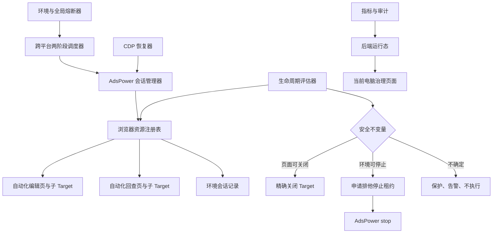

# 自媒体浏览器自动化运行时治理方案 V2（评审稿）

文档状态：评审通过，可以进入任务拆分

文档日期：2026-07-28

涉及范围：`geo-local-helper`、`geo-env-extension`、`geo-server`、`geo-web`

实施约束：阶段 1～6 按顺序拆分和推进；自动关闭页面、自动停止环境仍必须满足各阶段安全前置与灰度门槛

配套热修：[自媒体发布回查基础设施错误语义热修任务](./self-media-publish-check-infrastructure-semantics-hotfix-2026-07-28.md)

---

## 1. 评审结论

二轮评审已确认本方案通过，可以进入任务拆分。项目方向成立，生产问题真实，具备实施必要性，但必须以安全不变量为前提分阶段落地。

V2 对 V1 的核心调整：

1. 根因修正为“编辑页及部分子 Target 缺少统一生命周期治理”。
2. 用排他的环境停止租约替代只读 `mayStop` 检查。
3. 将任务阶段与不可逆安全边界彻底分离。
4. Target 所有权绑定浏览器会话，不跨浏览器重启复用。
5. 内容已改写但提交不确定的页面永久进入人工保护，不按时间自动关闭。
6. CDP 恢复按操作重放安全等级处理。
7. 执行、回查、基础设施次数独立计数且幂等。
8. 自动回收和停止受本地总开关、后端灰度策略和助手默认值共同控制。
9. 所有治理动作必须具备权限、原因、预览、二次校验和审计。

项目完整范围预计需要 22～30 人日开发测试，另需 1～2 周灰度观察。12～18 人日仅覆盖指标采集、资源注册表和安全关闭页面的 MVP。

---

## 2. 当前实现与问题边界

### 2.1 已确认事实

当前自动发布打开页面的主路径为：

```text
AdsPower start
→ Puppeteer connect
→ browser.newPage()
→ page.goto()
→ browser.disconnect()
```

`disconnect()` 只断开 Puppeteer，不关闭页面，也不停止 AdsPower 环境。任务终态后，助手会清理 `tasks.json` 历史记录，后端会释放调度锁和环境锁，但真实编辑页仍保留。

作品回查并非所有页面都会泄漏：

- 助手新建的回查主页面已有 `finally page.close()`；
- 已存在的管理页可能被复用并保留；
- 小红书等平台在回查过程中可能打开作品详情子 Target，当前没有统一登记和关闭；
- 回查当前会扫描浏览器全部页面，存在复用并导航人工管理页的风险。

### 2.2 根因结论

当前根因表述为：

> 编辑页及部分子 Target 缺少统一生命周期治理，随着运行时间和任务量增长，浏览器环境中的页面、Target 和相关资源可能持续累积，最终导致 CDP、扩展注入和页面执行退化。

标签页累积是高可信根因假设，但在开启自动治理前必须采集以下基线：

- 各 `providerProfileId` 的总 Target 数；
- 自动化、人工、未知 Target 数；
- SunBrowser/Chrome 进程 RSS、CPU、句柄数；
- CDP connect、`Browser.getVersion`、`browser.pages()` 延迟；
- `Network.enable timed out`、断连、注入错误和页面超时次数；
- 上述指标与任务量、运行时长的相关性。

### 2.3 当前已有安全能力

系统已具备：

- 调度领取代数 `attempt_count`；
- 陈旧回调防护；
- 同环境排他锁；
- 本地助手容量限制；
- 任务心跳和超时恢复；
- 内容改写和提交阶段上报；
- 已提交任务只允许回查；
- 助手、扩展运行态上报；
- 本地助手 HMAC 签名调用。

V2 在现有机制上增加资源治理层，不重写发布系统，不提高发布并发。

---

## 3. 项目目标与非目标

### 3.1 功能目标

1. 观察并解释每个 AdsPower 环境的资源压力。
2. 自动关闭助手明确创建、且已满足安全终态的页面和子 Target。
3. 永不自动关闭人工页面、未知页面和人工保护页面。
4. 自动停止助手明确从关闭状态启动、且取得排他停止租约的空闲环境。
5. 对失效 CDP endpoint 做一次安全刷新，对可重放操作做受控恢复。
6. 区分基础设施异常、内容状态不确定、发布结果未知和平台明确失败。
7. 避免基础设施异常耗尽业务执行或回查预算。
8. 避免异常回查长期饿死新发布任务。
9. 助手重启后能够安全恢复注册表并对账。
10. 支持预览安全清理、人工保护、释放保护、重新连接和安全停止。

### 3.2 非功能目标

- 不重复填充或发布；
- 不误关人工页面；
- 不停止人工打开或所有权不确定的环境；
- 不丢失待人工处理现场；
- 自动动作幂等、可审计、可解释；
- 注册表损坏、后端不可用、会话变化时 fail-closed；
- 新后端兼容旧助手、旧扩展；
- 所有执行型治理能力可独立关闭；
- 灰度策略不可用时，不执行自动关闭和自动停止。

### 3.3 非目标

- 替换 AdsPower；
- 全面重写平台适配器；
- 提升发布并发；
- 修改微信公众号官方 API 链路；
- 自动删除平台草稿或作品；
- 自动判定平台业务审核结果；
- 强制清理未知或人工资源；
- 远程控制其他电脑上的本地助手。

---

## 4. 安全不变量

以下规则优先级高于资源上限、空闲时间和运维便利：

1. 只有注册表明确记录为 automation 的资源允许自动关闭。
2. 资源关闭必须匹配原浏览器会话，禁止仅按 URL、平台或 Target ID 模糊匹配。
3. 不可逆边界只能前进，不能因消息乱序或重启回退。
4. `content_mutated` 且提交状态不确定时，禁止自动重填、自动关闭和自动停止环境。
5. `submission_attempted` 之后的任何不确定状态只允许回查，禁止重放发布。
6. 环境停止前必须持有后端排他停止租约。
7. 后端不可用、策略不可用、注册表损坏或状态不确定时，不执行自动治理动作。
8. 资源上限只用于准入、暂停领取和告警，不能作为关闭最老页面的依据。
9. 清理失败只影响治理状态，不改变业务发布结果。
10. 平台明确业务失败是进入 `publish_failed` 的唯一自动路径。

---

## 5. 总体架构



本地助手建议拆分：

```text
src/adspower-session-manager.js
src/browser-resource-registry.js
src/browser-lifecycle-policy.js
src/browser-governance-audit.js
src/environment-circuit-breaker.js
src/schedule-poll-policy.js
```

`server.js` 保留 HTTP 路由、调度编排、扩展任务交互和后端回调。

---

## 6. 单调不可逆边界

### 6.1 边界定义

```text
no_mutation
content_mutated
submission_attempted
submission_confirmed
```

边界排序：

```text
no_mutation
< content_mutated
< submission_attempted
< submission_confirmed
```

任意更新只能执行：

```text
nextBoundary = max(currentBoundary, reportedBoundary)
```

### 6.2 边界语义

| 边界 | 含义 | 允许自动重填 | 允许自动关闭 |
|---|---|---:|---:|
| `no_mutation` | 尚未改写标题、正文、封面、标签、位置或发布配置 | 是 | 失败终态确认后允许 |
| `content_mutated` | 页面内容已经或可能被改写，但未确认尝试提交 | 否 | 否，进入人工保护 |
| `submission_attempted` | 已点击或可能已触发发布/定时提交 | 否 | 后端确认收到 unknown/已提交状态后允许关闭编辑页 |
| `submission_confirmed` | 平台提交或发布结果已确认 | 否 | 后端确认后允许关闭 |

### 6.3 stage 的定位

`stage` 继续用于诊断，例如：

```text
waiting_editor
filling_title
filling_content
filling_cover
configuring_schedule
submitting_publish
verifying_publish_result
completed
```

但 `completed` 不自动等价于 `submission_attempted`。平台适配器必须显式上报边界。

进度事件增加：

```json
{
  "stage": "submitting_publish",
  "irreversibleBoundary": "submission_attempted",
  "sequence": 17,
  "occurredAt": "2026-07-28T18:00:00+08:00"
}
```

助手按 `sequence` 和边界等级处理乱序。相同任务、相同 claimAttempt 的低序号事件只能记审计，不得覆盖当前状态。

---

## 7. 浏览器资源所有权

### 7.1 资源记录

本地文件：

```text
geo-local-helper/runtime/browser-resources.json
```

建议结构：

```json
{
  "schemaVersion": 2,
  "registryRevision": 128,
  "helperBootId": "uuid",
  "resources": [
    {
      "resourceId": "uuid",
      "resourceType": "editor_tab",
      "resourceOrigin": "schedule_execution",
      "ownership": "automation",
      "taskId": 123,
      "scheduleId": 456,
      "claimAttempt": 2,
      "browserEnvironmentId": 12,
      "environmentKey": "brand_toutiao",
      "providerProfileId": "ads-profile-id",
      "browserSessionEpoch": "uuid",
      "browserWsBrowserId": "devtools-browser-id",
      "targetId": "target-id",
      "parentTargetId": null,
      "platform": "toutiao",
      "pageUrl": "https://mp.toutiao.com/...",
      "lifecycleState": "active",
      "irreversibleBoundary": "no_mutation",
      "backendReportState": "pending",
      "openedAt": "...",
      "lastTaskActivityAt": "...",
      "manualHoldRequired": false,
      "protectedUntil": null,
      "closedAt": null,
      "closeReason": null
    }
  ]
}
```

### 7.2 所有权

| 所有权 | 来源 | 自动关闭 |
|---|---|---:|
| `automation` | 调度执行或回查明确创建 | 满足安全门时允许 |
| `operator` | 管理页面人工打开、人工声明保护 | 禁止 |
| `unknown` | 助手启动前已存在、记录缺失或无法确认 | 禁止 |

`resourceOrigin` 至少包括：

```text
schedule_execution
publish_result_check
automation_child_target
operator_open
startup_discovered
unknown
```

从管理页面执行“打开环境”创建的页面必须标记为 `operator`，不能因为页面由助手调用 `newPage()` 创建就标记为自动化。

### 7.3 子 Target

助手创建页面后，应在受控窗口内监听 `Target.targetCreated`：

- opener 属于自动化资源且子 Target 域名属于原平台时，登记为 `automation_child_target`；
- 无法确认 opener 或来源时标记为 unknown；
- 自动关闭父页面时，逐个重新校验子 Target；
- 不按域名批量关闭同平台所有页面。

### 7.4 浏览器会话变化

每次从 AdsPower 获取动态 WebSocket 后生成或解析 `browserSessionEpoch`。

出现以下任一情况时视为新会话：

- DevTools browser ID 变化；
- AdsPower 明确停止后重新启动；
- WebSocket endpoint 的 browser identity 变化；
- 助手无法证明是同一浏览器会话。

旧会话资源统一转为：

```text
lifecycleState=stale
ownership=unknown
```

只保留审计，不自动映射到新会话 Target。

---

## 8. 注册表持久化与崩溃一致性

注册表必须具备：

- 单进程串行写入队列；
- 单调 `registryRevision`；
- 临时文件写入；
- 临时文件 fsync；
- 同目录原子 rename；
- 平台支持时对目录做 best-effort fsync；
- schemaVersion；
- 文件大小和记录数上限；
- 损坏文件隔离；
- 审计记录轮转。

建议写入顺序：

```text
生成下一 revision
→ 写 browser-resources.json.tmp
→ fsync(tmp)
→ rename(tmp, browser-resources.json)
→ 平台支持时 fsync(runtime 目录)
```

本地助手主要运行在 Windows。目录 fsync 不可用或原子替换被短暂占用时，应安全重试并保留上一版完整文件，不能先删除正式文件再替换。

崩溃窗口处理：

| 崩溃位置 | 恢复策略 |
|---|---|
| 页面已创建、资源未落盘 | 启动扫描为 unknown，只告警 |
| 资源已落盘、页面创建失败 | 标记 create_failed |
| 页面已关闭、closed 未落盘 | 启动对账后标记 target_missing |
| 后端已确认、本地未落盘 | 重试幂等查询/回调，不直接关闭 |
| 文件损坏 | 隔离损坏文件，全部发现资源视为 unknown |

不确定时宁可泄漏并告警，不自动认领或关闭。

---

## 9. 页面生命周期策略

| 状态 | 条件 | 策略 |
|---|---|---|
| `safe_pre_mutation_failure` | automation + `no_mutation` + 后端失败/重试状态已确认 | 默认 120 秒后关闭 |
| `safe_terminal` | automation + 后端成功终态或明确发布前终态 | 默认 60 秒后关闭 |
| `post_submission` | automation + 边界至少 `submission_attempted` + 后端已收到 unknown/成功 | 关闭编辑页，后续只回查 |
| `manual_hold_required` | `content_mutated` 且提交不确定 | 永久保护，直到显式释放 |
| `operator_hold` | 操作员保护 | 永久保护，直到取消 |
| `stale` | 浏览器会话变化 | 不关闭，只清理过期审计记录 |
| `unknown_owner` | 所有权无法确认 | 不关闭 |

45 分钟仅用于：

- 触发高优先级告警；
- 在管理页面突出显示；
- 通知操作员处理；
- 不触发自动关闭。

自动回收前必须重新验证：

1. registry revision 未发生冲突；
2. `providerProfileId + browserSessionEpoch + targetId` 精确匹配；
3. Target 域名仍属于原平台；
4. ownership 仍为 automation；
5. 没有活动任务引用；
6. 没有待回写结果；
7. 不在任何人工保护状态；
8. 后端结果满足对应关闭条件。

生命周期评估器建议每 60 秒运行一次。单轮未完成时跳过下一轮，不允许多个清理循环并发执行。

---

## 10. AdsPower 环境生命周期

### 10.1 环境状态

```text
unknown
opening
active
idle
pinned
quarantined
stop_lease_pending
stopping
stopped_idle
unhealthy
```

环境记录至少包含：

```text
browserEnvironmentId
providerProfileId
ownerType
startedByHelperBootId
startedAt
browserSessionEpoch
lastTaskActivityAt
pinnedAt
pinReason
quarantineUntil
```

只有助手在启动前明确确认环境为关闭状态，且启动后 browser session 与该动作绑定，才可标记 `ownerType=automation_started`。

若启动前状态不可确认、环境原本已打开、管理页面人工打开或 session epoch 非助手创建，则环境所有权为 unknown/operator，不允许自动停止。

### 10.2 停止条件

自动停止必须同时满足：

- `ownerType=automation_started`；
- browser session epoch 与启动记录一致；
- 没有本地活动任务；
- 没有待回写后端结果；
- 没有 `manual_hold_required`、operator 或 unknown 页面；
- 没有人工置顶；
- `lastTaskActivityAt` 超过空闲阈值；
- 后端灰度策略允许；
- 成功取得排他停止租约；
- 执行前二次本地校验仍通过。

发现任何未登记 Target 时，环境停止资格立即降级为 false。

### 10.3 排他停止租约

建议新增独立表：

```text
self_media_browser_environment_stop_lease
```

核心字段：

```sql
browser_environment_id
lease_token
request_idempotency_key
local_agent_session_id
machine_id
helper_boot_id
expires_at
status
reason
created_at
completed_at
```

申请接口：

```http
POST /api/v1/local-agent/browser-environments/{browserEnvironmentId}/stop-leases
```

请求：

```json
{
  "requestIdempotencyKey": "uuid",
  "providerProfileId": "ads-profile-id",
  "browserSessionEpoch": "uuid",
  "helperBootId": "uuid",
  "registryRevision": 128,
  "reason": "idle_timeout"
}
```

响应：

```json
{
  "granted": true,
  "leaseToken": "opaque-token",
  "expiresAt": "...",
  "activeScheduleIds": [],
  "reasons": []
}
```

阶段 4 开发任务必须先固化以下数据库和事务约束：

1. 当前租约表以 `browser_environment_id` 建立唯一约束，每个环境最多保留一条当前租约；历史变化写独立审计，不依赖同表堆叠历史行。
2. 申请使用 `request_idempotency_key`。另建租约申请幂等记录，对 `(local_agent_session_id, request_idempotency_key)` 建立唯一约束并保存请求摘要、租约 token 和原始响应；相同请求重复提交必须返回同一结果，不能生成第二个 token。幂等记录的保留期必须长于租约 TTL 和客户端最大重试窗口。
3. 申请租约事务先写入或读取幂等记录，再锁定环境及当前租约行，检查任务、环境锁、助手归属、session epoch、资源 revision 和策略，最后以条件更新取得租约并回填幂等结果；未过期的 `granted/stopping` 租约不得被覆盖。
4. 任务领取事务按相同锁顺序锁定环境及租约行，并将有效 `granted/stopping` 租约视为环境不可用。租约申请与任务领取并发时，只允许一方提交成功，不接受“先检查、后更新”的时间窗。
5. 批量领取或批量申请时按 `browser_environment_id` 升序加锁，降低死锁概率；发生死锁或条件更新失败时回滚整次竞争，由调用方用原幂等键安全重试。
6. 助手调用 AdsPower stop 前将租约从 `granted` 条件更新为 `stopping`；停止成功后 `complete`，失败或取消后 `release`，租约超时自动失效。所有状态转换必须校验 `lease_token`、助手会话和当前状态。

对应建表迁移、唯一索引、条件更新 SQL、事务隔离假设和并发测试，必须在阶段 4 任务卡中写明并评审通过，不能只留到编码时决定。

---

## 11. CDP 会话管理与安全恢复

### 11.1 操作等级

| 等级 | 示例 | 恢复策略 |
|---|---|---|
| `retry_safe` | 获取 endpoint、连接、`Browser.getVersion`、列页面、只读探测 | 刷新 endpoint 后最多重试一次 |
| `retry_with_reconcile` | 新建页、导航、打开回查页、选择上传页 | 先对账副作用，再决定是否重试 |
| `never_replay` | 文件上传、点击发布、定时提交、确认发布 | 禁止自动重放，只进入边界对应恢复流程 |

### 11.2 恢复流程

```text
CDP 错误
→ 分类为 session/transport 或业务页面错误
→ 检查操作重放等级
→ 清理 endpoint 缓存
→ 调用 AdsPower start 获取动态 endpoint
→ retry_safe 重试一次
→ retry_with_reconcile 先对账 Target/页面副作用
→ never_replay 不重放
→ 记录环境失败并评估熔断
```

会话类错误包括：

- `Network.enable timed out`
- `browser has disconnected`
- `websocket closed`
- `ECONNRESET`
- `ECONNREFUSED`
- `Protocol error`
- `socket hang up`

页面加载超时、平台 DOM 变化和账号登录问题不能计为 CDP 熔断失败。

---

## 12. 熔断

### 12.1 环境熔断

状态：

```text
closed
open
half_open
```

默认策略：

- 连续 2 次已分类的 CDP 基础设施失败后 open；
- 冷却 5 分钟；
- open 期间不发起重复连接；
- 冷却后进入 half_open；
- 每环境只允许一个单探针；
- 探针成功转 closed；
- 探针失败重新 open；
- 人工“重新连接”只触发受控探针，不直接重启有任务的环境。

### 12.2 AdsPower API 全局熔断

按 `apiBase` 维护全局熔断，用于 AdsPower API 整体不可用、连接拒绝或持续服务错误。

全局熔断打开时：

- 暂停所有新浏览器任务领取；
- 不逐个 profile 重试；
- 保留心跳和后端上报；
- 回查任务保持 unknown；
- 不改变业务发布结果。

AdsPower 限流不与连接失败混为同一计数，应采用服务返回的重试时间或独立退避。

---

## 13. 错误语义

### 13.1 错误码

新增：

| 错误码 | 分类 | 处理 |
|---|---|---|
| `ADSPOWER_CDP_TIMEOUT` | 基础设施 | 按边界延后执行或 unknown |
| `ADSPOWER_SESSION_STALE` | 基础设施 | 刷新 endpoint 一次 |
| `ADSPOWER_BROWSER_UNRESPONSIVE` | 基础设施 | 环境熔断 |
| `ADSPOWER_API_UNAVAILABLE` | 基础设施 | 全局熔断 |
| `EXTENSION_INJECTION_TRANSIENT` | 基础设施 | 仅在改写前重试一次 |
| `BROWSER_RESOURCE_LIMIT_REACHED` | 治理 | 暂停领取，不关闭最老页 |
| `BROWSER_ENVIRONMENT_QUARANTINED` | 治理 | 延后执行 |
| `BROWSER_CLEANUP_FAILED` | 治理 | 告警，不改变发布结果 |
| `BROWSER_REGISTRY_UNAVAILABLE` | 治理 | fail-closed |

保留现有：

```text
EXTENSION_HOST_PERMISSION_DENIED
```

该错误继续表示永久权限或实际清单配置问题。不得用新名称破坏旧前后端兼容。

### 13.2 后端状态矩阵

| 边界/上下文 | 基础设施异常结果 |
|---|---|
| `no_mutation` 执行阶段 | 回到执行队列并退避 |
| `content_mutated` | `manual_required`，保留现场 |
| `submission_attempted` | `publish_unknown`，仅回查 |
| 发布结果回查 | `publish_unknown`，延后回查 |
| 平台明确终态失败 | `publish_failed` |

后端以平台终态失败码白名单控制 `publish_failed`。旧助手即使调用 `publish-checks/failed`，基础设施错误也必须被归一化。

---

## 14. 独立且幂等的次数模型

数据库字段建议：

```sql
attempt_count                       INT NOT NULL DEFAULT 0
execution_attempt_count             INT NOT NULL DEFAULT 0
publish_check_attempt_count         INT NOT NULL DEFAULT 0
infrastructure_failure_count        INT NOT NULL DEFAULT 0
execution_max_attempts              INT NOT NULL
publish_check_max_attempts          INT NOT NULL
last_execution_counted_attempt      INT NULL
last_publish_check_counted_attempt  INT NULL
```

语义：

- `attempt_count`：每次领取原子增加，继续作为领取代数。
- `execution_attempt_count`：该 claimAttempt 首次成功进入浏览器执行后增加。
- `publish_check_attempt_count`：成功加载管理页并完成平台判断后增加。
- `infrastructure_failure_count`：按 incidentId 幂等增加。
- 基础设施异常不消耗执行或平台回查业务次数。

基础设施事件建议携带：

```json
{
  "incidentId": "uuid",
  "claimAttempt": 7,
  "phase": "publish_check_connect",
  "failureCode": "ADSPOWER_CDP_TIMEOUT"
}
```

前端展示：

```text
执行 1/3
回查 2/4
环境异常 3 次
领取代数 7
```

---

## 15. 跨平台两阶段公平调度

当前平台轮转继续保留，但领取策略改为两阶段：

```text
正常模式：
  跨平台查找回查任务
  → 最多连续领取 2 个

达到 burst limit：
  跨所有平台查找发布执行
  → 有任务则领取
  → 无任务才恢复回查
```

要求：

- burst 计数跨平台；
- 助手重启后允许重置，不影响业务正确性；
- 环境或全局熔断任务不得占用 burst；
- 领取失败不能误计为已执行；
- 容量仍保持 1；
- 不改变后端品牌安全间隔和环境互斥。

---

## 16. 观测指标与审计

### 16.1 环境级指标

每个环境至少上报：

```text
browserEnvironmentId
providerProfileId
browserSessionEpoch
ownerType
totalTargetCount
managedTargetCount
operatorTargetCount
unknownTargetCount
protectedTargetCount
lastTaskActivityAt
idleSeconds
cdpProbeLatencyMs
circuitState
consecutiveCdpFailures
lastCleanupAt
lastCleanupResult
```

助手级指标：

```text
managedEnvironmentCount
totalManagedTabCount
totalObservedTargetCount
cleanupClosedTabsTotal
cleanupStoppedEnvironmentsTotal
globalCircuitState
registryRevision
registryHealth
```

指标中的 total 必须明确是“本次启动累计”还是“生命周期累计”。建议同时上报 `helperBootId`，避免助手重启后累计值被误解。

### 16.2 审计事件

审计事件至少包含：

```text
eventId
eventType
resourceId
browserEnvironmentId
targetId
browserSessionEpoch
actorType
operatorId
reason
policyVersion
registryRevision
dryRun
result
occurredAt
```

事件类型：

```text
resource_registered
resource_protected
cleanup_previewed
target_close_attempted
target_closed
target_close_skipped
stop_lease_acquired
environment_stop_attempted
environment_stopped
environment_stop_failed
circuit_opened
circuit_half_opened
circuit_closed
```

本地审计采用轮转 JSONL。后端保存聚合指标和关键治理事件，避免仅靠本地文件导致生产事故无法集中追溯。

---

## 17. 灰度策略

生效优先级：

```text
本地紧急总开关
> 后端操作者/环境策略
> 助手默认值
```

本地总开关只允许关闭能力，不允许绕过后端禁止策略强制打开。

建议初始配置：

```json
{
  "browserObservationEnabled": true,
  "taskOwnedTabCleanupEnabled": false,
  "environmentIdleStopEnabled": false,
  "browserLifecycleEvaluationIntervalMs": 60000,
  "safeTerminalTabCloseDelayMs": 60000,
  "safePreMutationFailureCloseDelayMs": 120000,
  "uncertainMutationAlertMinutes": 45,
  "environmentIdleStopMinutes": 20,
  "maxManagedOpenEnvironments": 3,
  "maxManagedTabsPerEnvironment": 5,
  "maxTotalManagedTabs": 12,
  "cdpRecoveryEnabled": true,
  "cdpRecoveryMaxAttempts": 1,
  "environmentCircuitBreakerThreshold": 2,
  "environmentCircuitBreakerCooldownMinutes": 5,
  "globalAdspowerCircuitBreakerEnabled": true,
  "publishCheckBurstLimit": 2,
  "stopLeaseTtlSeconds": 60
}
```

`uncertainMutationAlertMinutes` 只控制告警升级，不是页面关闭 TTL。资源上限只控制准入和告警；人工页、未知页和保护页即使导致超限也不能自动关闭。

后端策略至少包含：

```json
{
  "policyVersion": 3,
  "operatorAllowlist": [1001],
  "browserEnvironmentAllowlist": [12, 15],
  "observationEnabled": true,
  "taskOwnedTabCleanupEnabled": false,
  "environmentIdleStopEnabled": false,
  "cdpRecoveryEnabled": true,
  "pollFairnessEnabled": true
}
```

后端策略超时或不可用时：

- 继续采集本地指标；
- 不自动关闭页面；
- 不自动停止环境；
- 不丢弃资源注册表；
- 已持有的停止租约按租约 TTL 和本地安全门处理，超时后放弃。

---

## 18. 数据库与接口

### 18.1 迁移拆分

不建议将全部改动塞入一个大迁移。建议：

```text
V330__self_media_publish_attempt_counters.sql
V331__self_media_browser_environment_stop_lease.sql
V332__local_agent_browser_runtime_metrics.sql
```

具体版本号以合并时仓库最新迁移为准。

`local_agent_runtime_status` 增加：

```sql
runtime_state          VARCHAR(32)
resource_metrics_json  JSON
last_cleanup_at        DATETIME
helper_boot_id         VARCHAR(64)
policy_version         BIGINT
```

单个标签页仍以本地注册表为准，不逐页写入业务数据库；关键治理动作通过审计事件集中留痕。

### 18.2 本地助手接口

```http
GET  /v1/adspower/managed-resources
POST /v1/adspower/managed-resources/cleanup-plans
POST /v1/adspower/managed-resources/cleanup-plans/{planId}/execute
POST /v1/adspower/environments/{providerProfileId}/pin
POST /v1/adspower/environments/{providerProfileId}/unpin
POST /v1/adspower/environments/stop-idle-plans
POST /v1/adspower/environments/stop-idle-plans/{planId}/execute
POST /v1/adspower/environments/{providerProfileId}/cdp-probes
```

预览计划必须返回 `planId`、`registryRevision`、过期时间和每个资源的判定理由。执行前重新校验，状态变化的资源只跳过，不强制执行。

### 18.3 能力协商

助手运行态 capabilities 增加：

```json
{
  "browserLifecycle": {
    "version": 2,
    "observation": true,
    "tabCleanup": true,
    "environmentStopLease": true,
    "cleanupPlans": true
  }
}
```

前端只对当前电脑、当前配对助手且能力匹配时展示操作按钮。

---

## 19. 前端、权限与产品交互

运行环境页增加：

- 当前电脑助手标识；
- 自动化、人工、未知、受保护页面数；
- 浏览器会话 epoch；
- 最近任务活动和空闲时长；
- 环境及全局熔断状态；
- 注册表健康状态；
- 最近治理结果；
- “预览安全清理”；
- “执行安全清理”；
- “保持环境开启”；
- “释放人工保护”；
- “安全停止空闲环境”；
- “探测并刷新 CDP”。

操作约束：

- 明确提示“仅操作当前电脑的本地助手”；
- 清理和停止需要 RBAC；
- 必填或选择操作原因；
- 预览后确认；
- 执行使用 planId 和 revision；
- 执行前二次校验；
- UI 展示关闭、跳过、失败及原因；
- 不提供“忽略安全门强制关闭”。

排期诊断页区分：

```text
平台明确发布失败
发布结果未知
本地执行环境异常
内容已改写、等待人工处理
可以重新执行
只能重新回查
禁止自动处理
```

---

## 20. 测试方案

### 20.1 本地助手

必须覆盖：

1. 只关闭当前 session epoch 下的 automation Target。
2. 不关闭 operator、unknown、stale Target。
3. 不跨浏览器重启复用 Target ID。
4. 不复用或导航人工管理页。
5. 自动登记明确来源的子 Target。
6. `content_mutated` 永久人工保护。
7. 45 分钟只告警，不关闭。
8. 待回写结果不回收。
9. 乱序 stage 不导致边界回退。
10. 注册表写入串行且 revision 单调。
11. 临时文件、fsync、rename 流程可恢复。
12. 注册表损坏时 fail-closed。
13. `retry_safe` 只重试一次。
14. `retry_with_reconcile` 先对账副作用。
15. `never_replay` 不重放上传和提交。
16. 环境熔断 half-open 单探针。
17. AdsPower 全局熔断阻止逐环境重试。
18. 资源上限只暂停领取，不关闭最老页。
19. 清理计划 revision 过期时跳过。

### 20.2 后端

必须覆盖：

1. 任务领取事务拒绝有效停止租约环境。
2. 停止租约申请与任务领取并发时只有一方成功。
3. 租约完成、释放和超时幂等。
4. 基础设施错误按不可逆边界进入正确状态。
5. 旧助手 failed 回调被归一化。
6. 平台明确失败仍进入 `publish_failed`。
7. 陈旧 claimAttempt 不能覆盖新状态。
8. 三类次数按 claimAttempt/incidentId 幂等。
9. 基础设施失败不消耗业务次数。
10. 新运行态字段对旧助手可选。
11. 灰度策略不可用时返回 fail-closed 策略。
12. RBAC 和当前助手绑定校验。

### 20.3 扩展

必须覆盖：

1. 显式上报不可逆边界。
2. 边界在不同平台适配器中语义一致。
3. 真正权限缺失继续使用 `EXTENSION_HOST_PERMISSION_DENIED`。
4. 临时注入错误仅在改写前重试一次。
5. 提交后消息通道关闭不重放任务。
6. 进度事件包含 sequence 和 occurredAt。
7. 扩展心跳不被误判为任务活动。

### 20.4 并发与故障注入

必须新增：

- `mayStop` 检查后并发领取的竞态回归测试；
- 停止租约与任务领取事务并发测试；
- `newPage` 后、落盘前崩溃；
- close 后、落盘前崩溃；
- 后端确认后、助手落盘前崩溃；
- Target ID 在新浏览器会话中重复；
- 操作员在自动环境中新增未知页面；
- 后端策略不可用；
- 助手和后端时钟偏差；
- AdsPower stop 返回成功但进程仍存活；
- 多环境同一助手的指标隔离。

---

## 21. 验收标准

### 21.1 观测阶段

- 建立不少于 24 小时的生产基线；
- 可以按环境关联 Target 数、RSS、CDP 延迟和错误；
- 注册表与真实 Target 对账可解释；
- 不执行任何自动关闭或自动停止。

### 21.2 页面治理

- 连续 100 条跨平台任务后，automation 页面保持在配置上限内；
- 允许的剩余量为人工页、未知页和受保护页，不要求总 Target 绝对不增长；
- 人工页、未知页、跨 session stale 页零误关；
- 所有关闭动作有精确 Target、原因、revision 和结果；
- `content_mutated` 页面不会因时间到期被关闭。

### 21.3 环境停止

- 无任务、无待回写、无保护/未知资源且持有停止租约时才能停止；
- 停止租约与新任务领取不存在双成功；
- 人工打开和未知所有权环境零自动停止；
- 后端或策略不可用时零自动停止。

### 21.4 错误语义

- 故障注入中的基础设施异常导致 `publish_failed` 为零；
- 平台明确拒绝、删除或失败仍准确进入 `publish_failed`；
- `submission_attempted` 后不发生重新填充或提交；
- 基础设施失败不消耗业务执行和回查次数。

### 21.5 稳定性

- 24 小时持续运行无单向无界资源增长；
- 建议在正式全量前增加一次 72 小时灰度；
- 一次瞬时 CDP 故障可以恢复；
- 持续故障进入熔断且无连接风暴；
- 功能关闭后恢复现有业务行为，但保留必要审计和观测。

---

## 22. 发布与灰度

### 阶段 0：紧急语义热修

- 后端归一化旧助手回查基础设施失败；
- 不修改浏览器资源；
- 不启用自动关闭和自动停止；
- 详见配套热修任务。

### 阶段 1：指标和注册表观察模式

- 上线注册表、Target 对账、资源指标和审计；
- 所有执行型治理开关关闭；
- 建立生产基线和根因证据。

### 阶段 2：不可逆边界和会话身份

- 扩展上报边界和 sequence；
- 助手维护单调边界；
- 资源绑定 browser session epoch；
- 验证重启和乱序场景。

### 阶段 3：页面安全回收

- 只对白名单操作者/环境开启；
- 先关闭回查子 Target；
- 再关闭安全终态编辑页；
- 不启用环境停止。

### 阶段 4：排他停止租约和环境停止

- 开发前完成租约表唯一约束、申请幂等键、锁顺序和并发事务方案评审；
- 先上线停止租约但不开自动停止；
- 验证领取事务与租约竞争；
- 小范围开启 20 分钟空闲停止；
- 只处理 `automation_started` 环境。

### 阶段 5：熔断、公平调度和独立计数

- 环境和全局熔断；
- half-open 单探针；
- 跨平台两阶段公平调度；
- 独立且幂等的次数模型。

### 阶段 6：扩展分类、前端治理和全量

- 完善注入错误分类；
- 上线 RBAC、预览计划和审计 UI；
- 经过 72 小时灰度后逐步全量。

---

## 23. 回滚

独立开关：

```text
browserObservationEnabled
taskOwnedTabCleanupEnabled
environmentIdleStopEnabled
cdpRecoveryEnabled
environmentCircuitBreakerEnabled
globalAdspowerCircuitBreakerEnabled
infrastructureFailurePolicyEnabled
pollFairnessEnabled
```

回滚顺序：

1. 关闭环境自动停止；
2. 关闭页面自动回收；
3. 保留注册表、指标和审计；
4. 关闭 CDP 自愈和熔断；
5. 必要时关闭新错误策略；
6. 不删除本地注册表和停止租约审计；
7. 数据库新增字段不做破坏性回滚。

---

## 24. 工作拆分与估算

| 工作包 | 估算 |
|---|---:|
| 紧急语义热修 | 1～2 人日 |
| 资源指标、基线和观察模式 | 3～4 人日 |
| 本地注册表、会话 epoch、崩溃恢复 | 4～5 人日 |
| 不可逆边界与扩展协议 | 3～4 人日 |
| 页面生命周期与子 Target | 3～4 人日 |
| 排他停止租约与环境停止 | 4～5 人日 |
| 熔断、公平调度、独立计数 | 3～4 人日 |
| 前端治理、RBAC、审计 | 2～3 人日 |
| 集成测试与故障注入 | 3～4 人日 |

部分工作可并行，合计按 22～30 人日管理，另加 1～2 周灰度观察。

---

## 25. 二轮评审已确认决策

1. 不可逆边界是业务安全的唯一依据，`stage` 只用于诊断。
2. 停止环境必须取得排他停止租约。
3. `content_mutated` 页面永久保护，45 分钟只升级告警。
4. 新浏览器 session 不恢复旧 Target 的自动所有权。
5. 后端策略不可用时，自动关闭和自动停止 fail-closed。
6. 本地助手回查仅由精确平台终态失败码进入 `publish_failed`，且不能影响官方 API 回查链路。
7. 独立计数使用额外幂等字段或事件，不能只增加三个可重复累加的计数列。
8. 管理操作仅针对当前电脑助手，不提供绕过安全门的强制关闭。
9. 项目按 22～30 人日开发测试、另加 1～2 周灰度观察排期。

阶段 1～6 可以按本文顺序进入任务拆分。阶段 0 紧急语义热修按配套任务独立优先上线。
